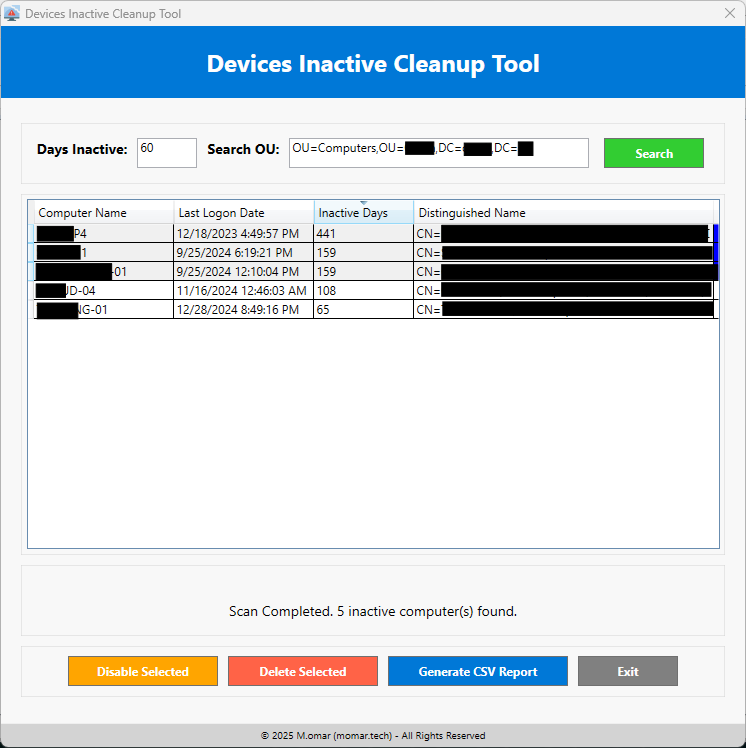

# Devices Inactive Cleanup Tool


## Overview
The **Devices Inactive Cleanup Tool** is a **WPF-based PowerShell script** designed to search for and manage **inactive computers** in **Active Directory**. It provides an intuitive GUI to:
- **Search for inactive computers** based on a specified number of inactive days.
- **Disable or delete selected computers** in Active Directory.
- **Export inactive computer details** to a CSV report.

This script ensures a seamless experience by using **background jobs** to prevent UI freezing while querying Active Directory.

---

## Screenshots




---

## Features
✅ **Graphical User Interface (GUI) using WPF**  
✅ **Search computers by inactivity days & Organizational Unit (OU)**  
✅ **Background job support** (non-blocking UI)  
✅ **DataGrid display with filtering & selection**  
✅ **Enable, disable, or delete inactive computers**  
✅ **Generate CSV reports of inactive devices**  
✅ **Custom WPF message dialogs for confirmations**  
✅ **Progress bar for AD query status**  

---

## Prerequisites
Before running this script, ensure you have:
1. **PowerShell 5.1 or later**
2. **Active Directory PowerShell module**  
   Install it (if not installed) using:
   ```powershell
   Add-WindowsFeature -Name RSAT-AD-PowerShell
   ```
3. **Active Directory Domain Admin Privileges**
4. **.NET Framework 4.5+ installed** (required for WPF)

---

## How to Run
### **Option 1: Run Directly**
Simply execute the script in PowerShell:
```powershell
.\DevicesUsersInactiveCleanupTool.ps1
```

### **Option 2: Run with Custom Parameters**
You can override the default values for inactivity days and the Organizational Unit (OU) by specifying parameters:
```powershell
.\DevicesUsersInactiveCleanupTool.ps1 -DaysInactive 120 -SearchOU "OU=IT,DC=company,DC=local"
```
- **`-DaysInactive`** → Number of days since the last logon to be considered inactive.
- **`-SearchOU`** → The specific OU to search for inactive computers.

---

## User Guide
### 1️⃣ **Searching for Inactive Computers**
- Enter the **number of days** since the last logon (default: **180**).
- Specify an **Organizational Unit (OU)** (default: **OU=Computers,DC=company,DC=local**).
- Click **"Search"** to query Active Directory.
- Results appear in the **DataGrid** with columns:
  - ✅ **Computer Name**
  - 📅 **Last Logon Date**
  - ⏳ **Inactive Days**
  - 🏷 **Distinguished Name (DN)**

### 2️⃣ **Disabling Computers**
- Select one or more inactive computers from the **DataGrid**.
- Click **"Disable Selected"**.
- A confirmation prompt will appear.
- If confirmed, the script will disable the selected computers in **Active Directory**.

### 3️⃣ **Deleting Computers**
- Select one or more inactive computers from the **DataGrid**.
- Click **"Delete Selected"**.
- A confirmation prompt will appear.
- If confirmed, the script will **permanently remove** the selected computers from **Active Directory**.

### 4️⃣ **Generating a CSV Report**
- Click **"Generate CSV Report"** to export **inactive computer details**.
- The script will prompt you for a **save location**.
- The report includes:
  - **Computer Name**
  - **Last Logon Date**
  - **Inactive Days**
  - **Distinguished Name (DN)**

---

## Error Handling
The script includes error handling to:
- **Validate input values** for inactivity days.
- **Check if Active Directory module is available** before running queries.
- **Display proper error messages** when encountering AD-related issues.

---

## License
This project is licensed under the **MIT License**. See the [LICENSE](LICENSE) file for details.

---

## Disclaimer
⚠ **Use this script at your own risk!**  
Always test in a **non-production environment** before applying changes to **Active Directory**.
