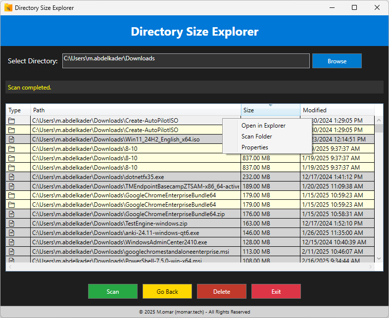

# 📁 Directory Size Explorer - PowerShell GUI Tool


## 📌 Overview

**Directory Size Explorer** is a modern PowerShell-based **GUI tool** that allows users to scan a selected directory and display the **fully recursive sizes** of files and folders. It provides an intuitive and **sortable DataGrid interface**, along with a **context menu for file operations** and an elegant **header and footer for branding**.

This tool is useful for **system administrators, IT professionals, and end-users** who need **real-time file size analysis, folder organization insights, and storage management**.

## Screenshots



## ✨ Features

✅ **Recursive Folder Size Calculation** – Accurately computes the **total size** of each folder, including subdirectories.  
✅ **Interactive GUI with DataGrid** – Displays results in a **sortable, searchable, and user-friendly** list.  
✅ **Folder & File Differentiation** – Uses **📁 (folder) and 📄 (file) symbols**, with distinct row coloring:  
   - **Folders:** Light yellow background  
   - **Files:** Light gray background  
✅ **Sorting by Size** – Ensures correct **numeric sorting** instead of string-based sorting using `SortMemberPath="Size"`.  
✅ **Navigation Controls** –  
   - **Browse:** Select a directory from an interactive folder picker.  
   - **Go Back:** Navigate one folder level up with a **single click**.  
✅ **File & Folder Operations (Context Menu)** – Right-click an item in the grid to:  
   - **Open in Explorer**
   - **Scan Single Item (Measure Size)**
   - **View Properties** (detailed metadata: size, modified date, creation date)  
✅ **Delete Functionality** – Select a file/folder and click **Delete** to remove it from the system.  
✅ **Modern Header & Footer for Branding** –  
   - **Header:** Blue banner with `"Directory Size Explorer"` title.  
   - **Footer:** `"© 2025 M.omar (momar.tech) - All Rights Reserved"` displayed at the bottom.  

---

## ⚙️ Installation & Requirements

### ✅ Prerequisites:
- **Operating System:** Windows 10/11  
- **PowerShell Version:** PowerShell 5.1+  
- **.NET Framework:** 4.5 or later (default on most modern Windows versions)  

### 🔧 Installation Steps:

1️⃣ **Download the Script:**  
   - Clone the repository or download the `DirectorySizeExplorer.ps1` file.
   ```powershell
   git clone https://github.com/mabdulkadr/DirectorySizeExplorer.git
   cd DirectorySizeExplorer
   ```

2️⃣ **Run the Script in PowerShell:**  
   ```powershell
   .\DirectorySizeExplorer.ps1
   ```

3️⃣ **Allow Execution (If Required):**  
   If you get an execution policy error, allow the script to run:
   ```powershell
   Set-ExecutionPolicy Unrestricted -Scope Process
   ```

---

## 📌 How to Use

### 1️⃣ **Select a Directory**
- **Manually Enter Path** in the text box **OR**  
- **Click "Browse"** to open the folder selection dialog.

### 2️⃣ **Scan the Directory**
- Click the **Scan** button to analyze the selected directory.
- **If a folder is selected in the grid**, that folder will be scanned instead.
- **If a file is selected**, a message will indicate that files cannot be scanned.

### 3️⃣ **Navigate Between Folders**
- Use the **Go Back** button to move up **one directory level**.
- **Double-click a folder** in the list to open it in **File Explorer**.

### 4️⃣ **Perform Actions on Items**
- **Right-click an item** in the results grid to:
  - **Open in Explorer**
  - **Scan Single Item (Measure Size)**
  - **View Properties** (size, modified date, etc.)

### 5️⃣ **Delete Files or Folders**
- Select an item in the list and click **Delete** to remove it permanently.
- **⚠️ Warning:** Deleting a folder will remove all contents inside.

### 6️⃣ **Exit the Tool**
- Click **Exit** to close the GUI.

---

### 🚀 Performance Optimization
- **Recursive folder scanning** can be slow for large directories. To **improve speed**, consider:
  - **Using Parallel Processing:** Implement `Start-Job` to scan multiple folders simultaneously.
  - **Limiting Scan Depth:** Modify `Get-ChildItem` to exclude deep subdirectories.

---

## 🛠️ Troubleshooting & FAQs

### 🔹 "Script is blocked from running"
**Solution:** Unblock the script:
```powershell
Unblock-File -Path .\DirectorySizeExplorer.ps1
```

### 🔹 "Folder sizes are showing as 0 KB"
**Cause:** Windows **denies access** to system directories for standard users.  
**Solution:** Run PowerShell as Administrator.

### 🔹 "Sorting by size is incorrect"
**Cause:** WPF’s default sorting is **string-based** instead of numeric.  
**Solution:** The script fixes this by using:
```xml
<DataGridTextColumn Header="Size" Binding="{Binding PrettySize}" SortMemberPath="Size" />
```
Ensure all data objects maintain a consistent `Size` type (`[long]`).

### 🔹 "Performance is slow on large directories"
**Solution:**  
- **Exclude unnecessary subdirectories.**
- **Run PowerShell in Administrator mode** for faster access to protected files.
- **Modify `Get-ChildItem` to scan only a limited depth**.

---

## 🔖 License

This project is licensed under the [MIT License](https://opensource.org/licenses/MIT).

