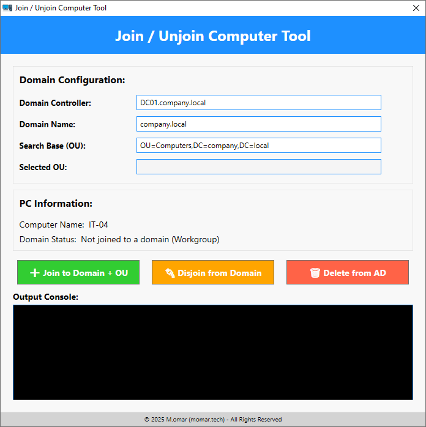

# JoinUnjoinComputerTool


## Overview

**JoinUnjoinComputerTool** is a PowerShell-based GUI tool designed to help IT administrators efficiently manage computer objects in Active Directory and Microsoft Entra ID (formerly Azure AD). This tool provides an intuitive interface for:

- Joining a computer to an **Active Directory (AD) domain** with Organizational Unit (OU) selection.
- Disjoining a computer from an **Active Directory (AD) domain**.
- Deleting computer objects from **Active Directory**.
- Joining or removing a computer from **Microsoft Entra ID** (Azure AD).
- Enrolling a computer into **Microsoft Intune** as a personal device.
- Displaying key device information such as domain status, IP address, Entra ID status, SCCM status, and Co-Management status.

---

## Screenshots



---

## Features

### ✅ Active Directory Management
- **Join to AD** with OU selection.
- **Disjoin from AD** and move to a workgroup.
- **Delete AD objects** with validation to prevent deleting active domain-joined machines.

### ✅ Microsoft Entra ID & Intune Management
- **Join to Entra ID** (Hybrid and Azure AD Join detection).
- **Leave Entra ID** and revert to a local machine.
- **Enroll into Intune** as a personal device.

### ✅ Device Information Display
- **Computer Name**
- **IP Address**
- **Domain Status** (Workgroup or Domain-Joined)
- **Entra ID Status** (Azure AD Joined, Hybrid, or Not Joined)
- **SCCM Client Status** (Installed & Running, Installed but Stopped, or Not Installed)
- **Co-Management Status** (Enabled, Disabled, or Not Detected)

### ✅ Intuitive UI
- **Modern PowerShell WPF GUI**
- **Dynamic Status Updates** with color-coded fields:
  - 🟢 Green = Active/Enabled
  - 🔴 Red = Inactive/Disabled
  - 🟠 Orange = Requires Attention
- **Confirmation Dialogs** for critical operations.
- **Logging & Error Handling** for troubleshooting.


---

## Installation & Usage

### Prerequisites
- Windows 10/11 or Windows Server 2016+
- PowerShell 5.1 or later
- **Administrator Privileges** required to modify system settings.

### Running the Script
1. Download the script:  
   ```powershell
   git clone https://github.com/mabdulkadr/Scripts.git
   cd Scripts/JoinUnjoinComputerTool
   ```
2. Run PowerShell as **Administrator**.
3. Execute the script:
   ```powershell
   Set-ExecutionPolicy -Scope Process -ExecutionPolicy Unrestricted -Force
   .\JoinUnjoinComputerTool.ps1
   ```
4. The GUI will launch, displaying device details and available actions.

---

## How It Works

### 🔹 PC Information Retrieval
The script gathers system details using:
- `Win32_ComputerSystem` for domain/workgroup status.
- `Get-NetIPAddress` for IP address resolution.
- `dsregcmd /status` for Entra ID detection.
- `Get-Service ccmexec` for SCCM client status.
- **WMI & Registry** for Co-Management detection:
  - `HKLM:\SOFTWARE\Microsoft\CCM\CoManagementFlags`
  - `HKLM:\Software\Policies\Microsoft\Windows\CurrentVersion\MDM`

### 🔹 Joining a Domain
- Prompts for **Active Directory credentials**.
- Uses `Add-Computer` to join the specified domain & OU.
- Validates if the machine is already in the domain.
- Restarts the computer upon successful operation.

### 🔹 Disjoining from a Domain
- Uses `Remove-Computer` to move to a **workgroup**.
- Ensures the machine is **not actively domain-joined** before deletion.

### 🔹 Microsoft Entra ID (Azure AD)
- Uses `dsregcmd /join` and `dsregcmd /leave` to **join or remove** Entra ID.
- Detects **Hybrid Join** vs **Azure AD Join**.

### 🔹 SCCM & Co-Management Detection
- SCCM **Client Service Check** (`ccmexec`).
- Co-Management detection via **WMI and Registry**.

---

## Troubleshooting

| Issue | Possible Cause | Solution |
|--------|---------------|----------|
| ❌ Script fails to launch | Execution policy restrictions | Run `Set-ExecutionPolicy -Scope Process -ExecutionPolicy Unrestricted -Force` |
| ❌ "Server is not operational" | Incorrect Domain Controller / OU settings | Verify AD settings and credentials |
| ❌ "Failed to join Entra ID" | Network issues / Incorrect permissions | Run `dsregcmd /status` manually |
| ❌ "Co-Management Not Detected" | SCCM is not installed or configured | Check `CoManagementFlags` registry key |

---

## Notes

- This script is designed for **IT administrators** and **system engineers** managing corporate environments.
- **Test in a lab** before deploying to production.
- Ensure that your **domain credentials** have appropriate **permissions** for joining/disjoining devices.

---

## License

This project is licensed under the **MIT License**. See the [LICENSE](https://opensource.org/licenses/MIT) file for details.

---

## Disclaimer
This script is provided **as-is**. Use it with caution, and **test in a non-production environment before deployment**. The author is **not responsible** for unintended modifications or data loss.


