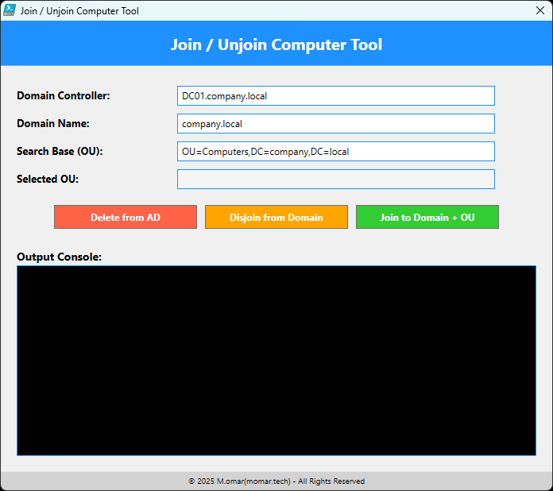

# Join / Unjoin Computer Tool


A PowerShell-based GUI tool to manage computer objects in Active Directory (AD). This script enables users to delete computer from AD, disjoin it from the domain, and join it to a domain in a selected Organizational Unit (OU) using LDAP queries.



---

## **Features**

- **Delete from AD**: Deletes the current computer object from AD using LDAP without requiring RSAT.
- **Disjoin from Domain**: Disjoins the computer from its domain and moves it to `WORKGROUP`.
- **Join to Domain + OU**:
  - Fetches a list of OUs dynamically from AD based on the provided search base.
  - Allows selecting an OU to join the computer to a specific location in the domain.
- **Logging**: Logs all operations (successes and errors) in a console section of the GUI.
- **Error Handling**: Provides clear error messages for missing credentials, invalid AD operations, and connectivity issues.
- **User-Friendly GUI**:
  - Input fields for `Domain Controller`, `Domain Name`, and `Search Base`.
  - Displays the selected OU's distinguished name.
  - Buttons to perform AD operations.
- **Restart Prompt**: Prompts the user to restart the computer when necessary.

---

## **Requirements**

- Windows PowerShell 5.1 or later.
- Administrator privileges.
- Active Directory credentials with permissions to manage computer objects.
- Network access to the specified Domain Controller.

---

## **How to Use**

1. **Download and Save**: Save the script as `JoinUnjoinComputerTool.ps1`.
2. **Run the Script**:
   Open PowerShell as Administrator and run:
   ```powershell
   .\JoinUnjoinComputerTool.ps1
   ```
3. **Enter Credentials**:  
   When prompted, enter valid Active Directory credentials.

4. **Perform Actions**:
   - **Delete from AD**:
     - Deletes the current computer object from AD based on the hostname.
   - **Disjoin from Domain**:
     - Disjoins the computer from the domain and deletes it from AD.
   - **Join to Domain + OU**:
     - Opens a window listing all OUs fetched from AD.
     - Select an OU and join the computer to that OU.

5. **View Logs**:  
   Logs are displayed in the "Output Console" section of the GUI.

---

## **Parameters**

| Parameter                 | Description                                      | Default Value                  |
|---------------------------|--------------------------------------------------|--------------------------------|
| `DefaultDomainController` | The Fully Qualified Domain Name (FQDN) of the Domain Controller. | `DC01.company.local`          |
| `DefaultDomainName`       | The name of the domain.                          | `company.local`               |
| `DefaultSearchBase`       | LDAP search base to filter Organizational Units. | `OU=Computers,DC=company,DC=local` |

---

## **GUI Layout**

### **Main Window**
1. **Domain Controller**: Input the FQDN of the domain controller.
2. **Domain Name**: Input the domain name.
3. **Search Base (OU)**: Input the LDAP search base for fetching OUs.
4. **Selected OU**: Displays the distinguished name (DN) of the selected OU.
5. **Buttons**:
   - **Delete from AD**: Deletes the computer object from AD.
   - **Disjoin from Domain**: Disjoins the computer and deletes it from AD.
   - **Join to Domain + OU**: Opens the OU selection window and joins the computer to the selected OU.
6. **Output Console**: Displays logs for actions and errors.

### **OU Selection Window**
1. Displays all OUs fetched from AD in a table with:
   - **Name**: Name of the OU.
   - **Description**: Description of the OU (if available).
   - **Distinguished Name**: Full DN of the OU.
2. Buttons:
   - **Select**: Select the highlighted OU and return to the main window.
   - **Cancel**: Close the window without making a selection.

---

## **Example Usage**

1. **Delete from AD**:
   - Click **Delete from AD** to remove the current computer object from Active Directory.

2. **Disjoin from Domain**:
   - Click **Disjoin from Domain** to remove the computer from its domain and delete it from AD.

3. **Join to Domain + OU**:
   - Click **Join to Domain + OU**.
   - Select an OU from the list and click **Select**.
   - The computer is joined to the specified domain and placed in the selected OU.

---

## **Known Issues**

- Ensure the `Domain Controller` and `Search Base` fields are correctly configured for your environment.
- Ensure the provided credentials have sufficient permissions to manage computer objects in AD.


---

## License

This project is licensed under the [MIT License](LICENSE).


---

**Disclaimer**: Use these scripts at your own risk. Ensure you understand their impact before running them in a production environment. Always review and test scripts thoroughly.
