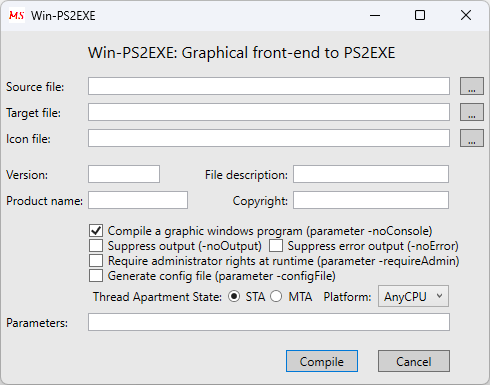

# Win-PS2EXE - PowerShell to EXE Converter (GUI)


## Overview
**Win-PS2EXE** is a user-friendly **Graphical User Interface (GUI)** tool that allows you to convert PowerShell scripts (`.ps1`) into standalone Windows executables (`.exe`). With a few clicks, you can package PowerShell scripts as self-contained executables, configure runtime settings, and secure your scripts without needing to run complex commands.

## **Screenshot**



---

## Features
✅ **No command-line knowledge required** – fully GUI-based  
✅ Supports **x86** and **x64** architectures  
✅ Hide PowerShell console for **GUI applications**  
✅ Embed **icons, metadata, and additional files** into the EXE  
✅ **Run as Administrator** option  
✅ Customize execution parameters  
✅ **Obfuscation** options for added security  

---

## Installation

### **Option 1: Install via PowerShell**
You can install **Win-PS2EXE** using PowerShell:

```powershell
Install-Module -Name ps2exe -Scope CurrentUser
```

### **Option 2: Manual Download**
1. Download **`Win-PS2EXE.exe`** and **`PS2EXE.ps1`**.
2. Ensure **PS2EXE.ps1** is in the same directory as **Win-PS2EXE.exe** before running.

---

## How to Use (GUI Mode)
### **Step 1: Start Win-PS2EXE**
- Double-click **`Win-PS2EXE.exe`** to launch the application.

### **Step 2: Select the PowerShell Script**
- Click the **Browse...** button next to `Source File` and choose your `.ps1` script.

### **Step 3: Choose Output File**
- Click the **Browse...** button next to `Target File` and define where the `.exe` should be saved.

### **Step 4: Configure Options (Optional)**
You can configure several options before conversion:
- **Run without Console:** Hide the PowerShell window when the script executes.
- **Require Administrator:** Prompt for elevated privileges when running the `.exe`.
- **Icon File:** Embed a custom icon (`.ico`) for branding.
- **Additional Parameters:** Customize script execution.

### **Step 5: Compile**
- Click **Compile** to start the conversion process.
- A PowerShell window will open and execute the compilation process.
- Once completed, the `.exe` file will be generated in the specified target location.

---

## Example Use Cases
✔ Deploy PowerShell scripts as applications  
✔ Hide sensitive PowerShell code inside an `.exe`  
✔ Run scripts with a double-click instead of the PowerShell console  
✔ Distribute PowerShell-based tools with a professional look  

---

## Notes
- **Antivirus Warnings:** Some `.exe` files generated may trigger false positives—test before distribution.
- **Script Security:** Avoid embedding passwords or sensitive data in your script before conversion.
- **Execution Policy:** Ensure that your script works as expected before converting it.

---

## References
- **GitHub Repository:** [Win-PS2EXE](https://github.com/MScholtes/PS2EXE/tree/master/Win-PS2EXE)
- **Official Documentation:** [Win-PS2EXE Wiki](https://github.com/MScholtes/Win-PS2EXE/wiki)
- **Discussions & Issues:** [GitHub Issues](https://github.com/MScholtes/Win-PS2EXE/issues)

---

## License
This project is licensed under the [MIT License](https://opensource.org/licenses/MIT).

---

**Disclaimer:** This tool is provided as-is. Always test generated executables before production deployment.
